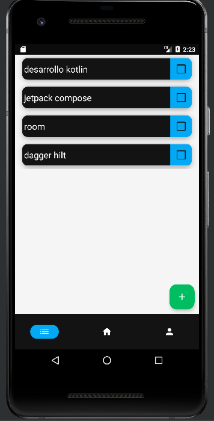
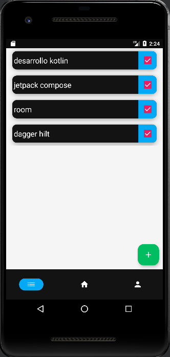
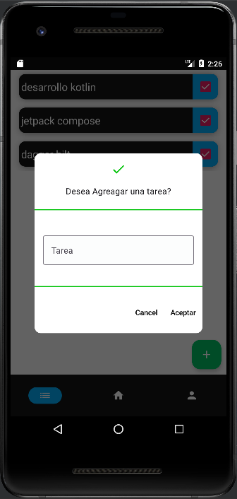
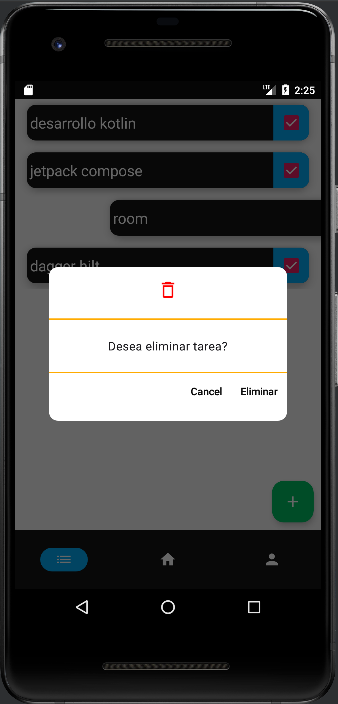

# ToDo List Jetpack compose

## TaskMaster is a mobile application designed to help you efficiently and effectively keep track of your daily tasks. With TaskMaster, you can effortlessly create and delete tasks in the form of a "to-do list" to keep your life organized and productive.

## characteristics

- Use of RecyclerView
- Layout with JetPack Compose
- coroutines
- Navigation Compose
- Dependency injection with Dagger Hilt
- MVVM (Model-View-ViewModel) architecture
- Clean Architecture
- Room


## Installation:

```
Dependencies{
   
   //DaggerHilt
    implementation "com.google.dagger:hilt-android:2.41"
    kapt "com.google.dagger:hilt-android-compiler:2.41"

    //LiveData
    implementation"androidx.lifecycle:lifecycle-livedata-ktx:2.5.1"
    implementation("androidx.compose.runtime:runtime-livedata:1.3.2")
    implementation "androidx.hilt:hilt-navigation-compose:1.0.0-alpha03"


    //Navigation
    implementation "androidx.navigation:navigation-compose:2.5.1"

    //Room
    implementation "androidx.room:room-runtime:2.5.1"
    kapt "androidx.room:room-compiler:2.5.1"
    implementation "androidx.room:room-ktx:2.5.1"
}
```


# Layout

## List tasks



## Dialog AddTask


## Dialog RemoveTask



## App


## Home
# Project under development currently 🛠⚙
## profile
# Project under development currently 🛠⚙


# Project under development currently 🛠⚙